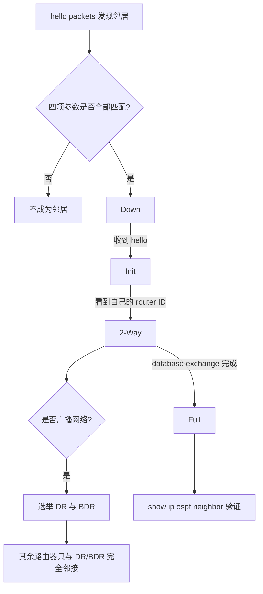

# OSPF · 面试复习 / Interview Review

> **覆盖章节**:1 章 · **原文依据校验**:38/38 条通过
> **说明**:题目的核心答案均可追溯到课程原文;标注为 🔶 课程外扩展 的段落
> 属于工程经验补充,**不属于课程内容**,面试时可作为加分项,但请自行判断适用性。

## 覆盖的章节

| 章节 | 在本协议中的作用 |
| --- | --- |
| [OSPF 邻居邻接关系](ospf-neighbor-adjacency.md) | hello 报文与邻居发现,四项必须匹配的参数；邻居状态 Down、Init、2-Way、Full 及各自触发条件；广播网络上 DR 与 BDR 的选举判定顺序；用 show ip ospf neighbor 验证邻居状态与接口 |

本协议目前覆盖的内容集中在邻居关系的建立与验证上:hello 报文如何发现邻居、四项参数为什么必须同时匹配、邻居状态如何从 Down 推进到 Full、广播网络上 DR 与 BDR 如何选举,以及如何用命令验证结果。面试中这一块问得最细,因为它同时考概念、顺序和排查思路。

## 一、知识体系图 / Knowledge Map

**建议复习顺序:**

1. 先看 hello 报文与四项匹配参数 —— 这是所有后续内容的前提,邻居都建不起来就谈不上状态推进。
2. 再看邻居状态机 Down 到 Full —— 重点记每一步的触发条件,而不是状态名字。
3. 然后看 DR 与 BDR 选举 —— 它只在广播网络上发生,判定顺序和特例要一起记。
4. 最后看验证命令 —— 把 show ip ospf neighbor 的 State 列和前面的状态机对应起来,形成闭环。

## 二、必须掌握清单 / Must Master

> 面试前必须能张口就答。答不上来的,回到对应章节重看。

### 1. hello interval、dead interval、area ID、子网掩码四项必须同时匹配,两台路由器才会成为邻居。

- **为什么必须掌握**:这是邻居关系的准入条件,也是排查邻居建不起来时的第一张检查清单。只记住一项就会漏掉另外三个原因。
- **原文依据**:`ospf-neighbor-adjacency-69619352` p.1 — “Two routers become neighbors only when the hello interval, the dead interval, the area I…”

### 2. hello 报文在广播网段上发往组播地址 224.0.0.5,每 10 秒一次;dead interval 默认 40 秒,是其四倍。

- **为什么必须掌握**:这两个数值几乎是必问的送分题,而且 40 与 10 的四倍关系还会被继续追问为什么这样设计。
- **原文依据**:`ospf-neighbor-adjacency-69619352` p.1 — “The hello packet is sent to multicast address 224.0.0.5 every 10 seconds on a broadcast…” ; `ospf-neighbor-adjacency-69619352` p.1 — “The dead interval is 40 seconds by default, which is four times the hello interval.”

### 3. 进入 2-Way 的条件是在收到的 hello 报文里看到自己的 router ID,而不是又收到一个 hello。

- **为什么必须掌握**:这是区分背过与真懂的分水岭。答成又收到一个 hello,面试官立刻知道候选人没理解双向确认的含义。
- **原文依据**:`ospf-neighbor-adjacency-69619352` p.2 — “Once the router sees its own router ID in the received hello packet, the neighbor moves…”

### 4. DR 选举先比 OSPF priority 且最高者胜,priority 相同再比 router ID 且最大者胜,priority 为 0 者永不当选。

- **为什么必须掌握**:顺序、方向、特例三点缺一不可,是最容易被连环追问的地方。
- **原文依据**:`ospf-neighbor-adjacency-69619352` p.3 — “The router with the highest OSPF priority becomes the designated router.” ; `ospf-neighbor-adjacency-69619352` p.3 — “A priority of 0 means the router will never become the designated router.”

### 5. 选出 DR 和 BDR 后,其余路由器只与 DR 和 BDR 建立完全邻接,彼此之间不建立。

- **为什么必须掌握**:这一条直接回答了为什么要选举,是把知识点串成体系的关键;答不出来说明只背了规则没理解目的。
- **原文依据**:`ospf-neighbor-adjacency-69619352` p.3 — “All other routers form a full adjacency only with the DR and the BDR.”

## 三、高频必考基础 / 原理题 / Fundamentals

### F1〔难度 ★★ · 邻居建立 / 高频〕

**问 / Q**

- 🇨🇳 请完整讲一遍 OSPF 邻居关系是怎么从零建立到完全邻接的。
- 🇬🇧 Walk me through how an OSPF neighbor relationship is established from scratch to full adjacency.

高分答题模板 · 得分要点(建议先自己答)

#### 🇨🇳 中文答题模板

> **开场结论**:一句话说:先靠 hello 报文互相发现,再核对四项参数确认是邻居,然后状态从 Down 依次推进到 Init、2-Way,数据库交换完成后到 Full。

**发现阶段** — 路由器在链路上互发 hello 报文来发现邻居。在广播网段上,hello 报文发往组播地址 224.0.0.5,每 10 秒一次。

**准入条件** — 收到 hello 还不够,必须 hello interval、dead interval、area ID 和子网掩码四项全部匹配,才会成为邻居;其中 dead interval 默认 40 秒,是 hello interval 的四倍。

**状态推进** — 最初是 Down,表示还没收到过 hello;收到 hello 后进入 Init;在收到的 hello 里看到自己的 router ID 后进入 2-Way;数据库交换完成后到达 Full。

**验证方法** — 用 show ip ospf neighbor 查看,输出里的 State 列就是上面的状态,Interface 列说明邻居在哪条链路上。

> **收尾**:所以判断邻接是否真的建好,标准是 State 到 Full,而不是能看到邻居条目。

#### 🇬🇧 English answer template

> **Opening**: In short: routers discover each other with hello packets, check four parameters to accept each other as neighbors, then move from Down through Init and 2-Way, and reach Full after the database exchange.

**Discovery** — OSPF routers use hello packets to discover neighbors on a link. On a broadcast network segment the hello packet is sent to multicast address 224.0.0.5 every 10 seconds.

**Acceptance conditions** — Two routers become neighbors only when the hello interval, the dead interval, the area ID and the subnet mask all match. The dead interval is 40 seconds by default, four times the hello interval.

**State progression** — The first state is Down. Receiving a hello packet moves the neighbor to Init. Seeing its own router ID in the received hello packet moves it to 2-Way. After the database exchange finishes it reaches Full.

**Verification** — Use the show ip ospf neighbor command; the State column shows the state and the Interface column shows where the neighbor was found.

> **Closing**: So the real criterion for a working adjacency is reaching the Full state, not merely seeing a neighbor entry.

#### 得分要点 / Scoring points

| 🇨🇳 | 🇬🇧 |
| --- | --- |
| 说出 hello 报文与组播地址 224.0.0.5、10 秒周期 | Mentions hello packets, multicast address 224.0.0.5 and the 10 second interval |
| 四项匹配参数完整说出且强调必须全部匹配 | Lists all four matching parameters and stresses that all must match |
| 四个状态顺序正确,并说出各自触发条件 | Gives the four states in the right order with their triggers |
| 2-Way 的条件说成看到自己的 router ID | States the 2-Way trigger as seeing its own router ID |
| 提到用 show ip ospf neighbor 验证 | Mentions verifying with show ip ospf neighbor |

原文依据:`ospf-neighbor-adjacency-69619352` p.1 — “OSPF routers use hello packets to discover neighbors on a link.” ; `ospf-neighbor-adjacency-69619352` p.2 — “An OSPF neighbor moves through several states before the adjacency is complete.”

> 🔶 **课程外扩展(非 PDF 内容,酌情使用)**
>
> 🇨🇳 实际排障时,这套流程通常配合抓包一起看:如果一端在发、另一端完全收不到,问题往往在二层而不是 OSPF 本身。这一点课程原文没有涉及,属于工程经验。
>
> 🇬🇧 In real troubleshooting this flow is usually combined with packet capture: if one side sends but the other receives nothing, the problem is often at layer 2 rather than in OSPF itself. This is field experience, not part of the course material.

### F2〔难度 ★ · 参数 / 送分题〕

**问 / Q**

- 🇨🇳 两台路由器要成为 OSPF 邻居,必须匹配哪几项参数?漏掉一项会怎样?
- 🇬🇧 Which parameters must match for two routers to become OSPF neighbors, and what happens if one does not match?

高分答题模板 · 得分要点(建议先自己答)

#### 🇨🇳 中文答题模板

> **开场结论**:四项:hello interval、dead interval、area ID 和子网掩码,必须全部匹配。

**分类记忆** — 这四项可以分两类记:时间参数是 hello interval 和 dead interval,身份与网段参数是 area ID 和子网掩码。

**逻辑关系** — 原文的表述是 only when ... all match,是四项同时成立的关系,任意一项不一致就不会成为邻居。

> **收尾**:所以排查邻居建不起来时,这四项要逐项核对,不能只看其中一项。

#### 🇬🇧 English answer template

> **Opening**: Four parameters: the hello interval, the dead interval, the area ID and the subnet mask, and all of them must match.

**How to remember** — Two of them are timers, the hello interval and the dead interval; the other two identify the area and the segment, the area ID and the subnet mask.

**Logical relation** — The wording is only when all match, so it is a conjunction: if any single one differs, the routers do not become neighbors.

> **Closing**: When an adjacency does not come up, check all four rather than just one of them.

#### 得分要点 / Scoring points

| 🇨🇳 | 🇬🇧 |
| --- | --- |
| 四项一个不漏 | Lists all four parameters |
| 明确说明必须全部匹配 | States explicitly that all must match |
| 能指出任意一项不一致就不成为邻居 | Notes that a single mismatch prevents the adjacency |

原文依据:`ospf-neighbor-adjacency-69619352` p.1 — “Two routers become neighbors only when the hello interval, the dead interval, the area I…”

### F3〔难度 ★★ · 状态机〕

**问 / Q**

- 🇨🇳 Init 和 2-Way 分别在什么条件下进入?两者的本质区别是什么?
- 🇬🇧 Under what conditions does a neighbor enter Init and 2-Way, and what is the essential difference?

高分答题模板 · 得分要点(建议先自己答)

#### 🇨🇳 中文答题模板

> **开场结论**:收到 hello 报文进入 Init;在收到的 hello 报文里看到自己的 router ID 才进入 2-Way。区别在于单向与双向。

**Init 的含义** — Init 只说明本端收到了对方的 hello,并不说明对方收到了本端的 hello,所以只能证明单向。

**2-Way 的含义** — 对方发来的 hello 里出现了本端的 router ID,说明对方此前收到过本端的 hello,双向可达因此得到确认,这正是 2-Way 这个名字的来源。

> **收尾**:所以状态停在 Init,通常意味着有一个方向的 hello 没有被对端收到。

#### 🇬🇧 English answer template

> **Opening**: Receiving a hello packet moves the neighbor to Init; seeing its own router ID in the received hello packet moves it to 2-Way. The difference is one direction versus both directions.

**What Init means** — Init only shows that this router received a hello packet from the other side; it says nothing about the reverse direction.

**What 2-Way means** — Once the router sees its own router ID in the received hello packet, the other router must have received its hello earlier, so both directions are confirmed.

> **Closing**: A neighbor stuck in Init therefore usually means one direction of hello packets is not getting through.

#### 得分要点 / Scoring points

| 🇨🇳 | 🇬🇧 |
| --- | --- |
| Init 的条件说成收到 hello 报文 | Gives receiving a hello packet as the Init trigger |
| 2-Way 的条件说成看到自己的 router ID | Gives seeing its own router ID as the 2-Way trigger |
| 点出单向与双向这一本质区别 | Explains the one-way versus two-way difference |

原文依据:`ospf-neighbor-adjacency-69619352` p.2 — “When a router receives a hello packet it moves the neighbor to the Init state.” ; `ospf-neighbor-adjacency-69619352` p.2 — “Once the router sees its own router ID in the received hello packet, the neighbor moves…”

### F4〔难度 ★★ · 选举 / 高频〕

**问 / Q**

- 🇨🇳 广播网络上 DR 与 BDR 是怎么选出来的?判定顺序和特例分别是什么?
- 🇬🇧 How are the DR and BDR elected on a broadcast network, in what order are the criteria applied, and what is the exception?

高分答题模板 · 得分要点(建议先自己答)

#### 🇨🇳 中文答题模板

> **开场结论**:先比 OSPF priority,最高者成为 DR;priority 相同再比 router ID,最大者赢得选举;priority 为 0 的永远不会成为 DR。

**第一顺位** — OSPF priority 最高的路由器成为 DR,方向是越高越优先,不是越低越优先。

**第二顺位** — 只有在 priority 相同分不出胜负时,才比较 router ID,并且同样是最大者赢得选举。

**特例** — priority 为 0 意味着该路由器永远不会成为 DR,直接被排除在比较之外。

> **收尾**:选举的前提是广播网络,原文明确限定了这一点,不能不加条件地推广到其他情况。

#### 🇬🇧 English answer template

> **Opening**: First compare OSPF priority and the highest becomes the DR; if the priority is equal, compare router ID and the highest wins; a priority of 0 never becomes the DR.

**First criterion** — The router with the highest OSPF priority becomes the designated router, so higher wins rather than lower.

**Second criterion** — Only when the priority is equal does the router with the highest router ID win the election.

**Exception** — A priority of 0 means the router will never become the designated router and is excluded from the comparison.

> **Closing**: Note the precondition: this election happens on a broadcast network, as the material states explicitly.

#### 得分要点 / Scoring points

| 🇨🇳 | 🇬🇧 |
| --- | --- |
| 顺序正确:先 priority 后 router ID | Correct order: priority first, then router ID |
| 方向正确:两者都是最大者胜 | Correct direction: highest wins in both cases |
| 说出 priority 为 0 的特例 | Mentions the priority 0 exception |
| 点出前提是广播网络 | Notes the broadcast network precondition |

原文依据:`ospf-neighbor-adjacency-69619352` p.3 — “On a broadcast network OSPF elects a designated router and a backup designated router.” ; `ospf-neighbor-adjacency-69619352` p.3 — “When the priority is equal, the router with the highest router ID wins the election.”

### F5〔难度 ★★★ · 设计意图〕

**问 / Q**

- 🇨🇳 为什么广播网络上要选举 DR 和 BDR?选完之后邻接关系变成什么样?
- 🇬🇧 Why does OSPF elect a DR and a BDR on a broadcast network, and what do the adjacencies look like afterwards?

高分答题模板 · 得分要点(建议先自己答)

#### 🇨🇳 中文答题模板

> **开场结论**:因为选完之后其余路由器只与 DR 和 BDR 建立完全邻接,不再两两建立,完全邻接关系被集中到两台路由器上。

**选举结果** — 在广播网络上,OSPF 会选出一台 DR 和一台 BDR,BDR 是 DR 的备份。

**邻接关系的形态** — 原文用了 only:其余路由器只与 DR 和 BDR 建立完全邻接,它们彼此之间不建立完全邻接。

> **收尾**:所以选举的意义就在于改变完全邻接关系的形态,而不只是选出一个角色名。

#### 🇬🇧 English answer template

> **Opening**: Because afterwards all other routers form a full adjacency only with the DR and the BDR instead of with each other, concentrating full adjacencies on two routers.

**Election result** — On a broadcast network OSPF elects a designated router and a backup designated router, the latter acting as the backup.

**Resulting adjacencies** — All other routers form a full adjacency only with the DR and the BDR, not with one another.

> **Closing**: So the point of the election is to change the shape of the full adjacencies, not merely to assign a title.

#### 得分要点 / Scoring points

| 🇨🇳 | 🇬🇧 |
| --- | --- |
| 说出选出 DR 与 BDR 两台 | States that both a DR and a BDR are elected |
| 说出其余路由器只与这两台建立完全邻接 | States that other routers form full adjacency only with these two |
| 点出 only 的排他含义 | Highlights the exclusive meaning of only |

原文依据:`ospf-neighbor-adjacency-69619352` p.3 — “All other routers form a full adjacency only with the DR and the BDR.”

### F6〔难度 ★ · 验证 / 命令〕

**问 / Q**

- 🇨🇳 怎么验证 OSPF 邻接关系已经建立?输出里你会重点看哪几列?
- 🇬🇧 How do you verify that an OSPF adjacency is established, and which columns of the output do you focus on?

高分答题模板 · 得分要点(建议先自己答)

#### 🇨🇳 中文答题模板

> **开场结论**:用 show ip ospf neighbor 命令,重点看 State 列和 Interface 列。

**State 列** — State 就是前面讲的邻居状态;看到 FULL 说明数据库交换已经完成,停在 Init 或 2-Way 则说明某一步的触发条件还没满足。

**Interface 列** — Interface 说明这个邻居是在哪条链路上发现的,便于把问题定位到具体接口。

> **收尾**:所以验证的判据是 State 到 FULL,并确认它出现在预期的接口上。

#### 🇬🇧 English answer template

> **Opening**: Use the show ip ospf neighbor command and focus on the State and Interface columns.

**State column** — The State column is the neighbor state discussed earlier: FULL means the database exchange has finished, while Init or 2-Way means some trigger has not been satisfied yet.

**Interface column** — The Interface column shows on which link the neighbor was discovered, which helps pin the problem to a specific interface.

> **Closing**: The criterion is therefore State reaching FULL on the expected interface.

#### 得分要点 / Scoring points

| 🇨🇳 | 🇬🇧 |
| --- | --- |
| 命令名准确写出 show ip ospf neighbor | Gives the exact command show ip ospf neighbor |
| 说出 State 列并与状态机对应 | Explains the State column and maps it to the state machine |
| 说出 Interface 列的用途 | Explains what the Interface column is for |

原文依据:`ospf-neighbor-adjacency-69619352` p.4 — “Use the show ip ospf neighbor command to verify the adjacency.” ; `ospf-neighbor-adjacency-69619352` p.4 — “The output below shows the neighbor state and the interface.”

## 四、场景化面试题 / Scenario Questions

> 场景题考的不是背诵,而是**排查与推导的顺序**。先看场景自己走一遍流程,再看解题框架。

### S1〔难度 ★★〕

**场景 / Scenario**

- 🇨🇳 R1 与 R2 通过 192.168.12.0/24 直连,两侧都启用了 OSPF。在 R1 上执行 show ip ospf neighbor,能看到 R2 的条目,但 State 列一直停在 Init,不再往前推进。接口 GigabitEthernet0/1 状态正常。
- 🇬🇧 R1 and R2 are directly connected over 192.168.12.0/24 and both run OSPF. On R1 the show ip ospf neighbor output does list R2, but the State column stays at Init and never progresses. Interface GigabitEthernet0/1 is up.

**要求 / Task**

- 🇨🇳 请根据本章内容说明 Init 意味着什么,还缺哪个条件,以及你会按什么顺序去核对。
- 🇬🇧 Explain what Init means here, which condition is still missing, and in what order you would check things.

解题框架 · 参考答案 · 得分要点

#### 解题框架(按顺序走)

1. 第一步:确认 Init 的含义 —— 本端已经收到了对方的 hello 报文,所以链路上至少有一个方向是通的。
2. 第二步:确认还缺什么 —— 要进入 2-Way,必须在收到的 hello 报文里看到自己的 router ID,现在没看到。
3. 第三步:推断方向 —— 没看到自己的 router ID,说明对方此前没有收到过本端的 hello,即反方向有问题。
4. 第四步:核对四项参数 —— hello interval、dead interval、area ID 和子网掩码必须全部匹配,逐项比对两端配置。
5. 第五步:回到命令验证 —— 修正后再看 State 列是否从 Init 推进到 2-Way 以至 Full。

#### 参考答案

- 🇨🇳 State 停在 Init 说明 R1 已经收到过 R2 的 hello 报文,所以不是完全不通。要从 Init 进入 2-Way,条件是 R1 在收到的 hello 报文里看到自己的 router ID;既然没进入 2-Way,说明 R2 发来的 hello 里没有 R1 的 router ID,也就意味着 R2 此前没有收到过 R1 的 hello,问题出在 R1 到 R2 这个方向。接着按四项必须匹配的参数逐项核对:hello interval、dead interval、area ID 和子网掩码,任意一项不一致都会导致双方不成为邻居。修正之后再用 show ip ospf neighbor 观察 State 是否推进到 Full。
- 🇬🇧 Init means R1 has already received a hello packet from R2, so the link is not completely broken. To move from Init to 2-Way, R1 must see its own router ID in the received hello packet; since that has not happened, the hello packets from R2 do not carry R1 router ID, which implies R2 never received a hello from R1, so the problem is in the R1 to R2 direction. Then check the four parameters that must all match: the hello interval, the dead interval, the area ID and the subnet mask. After fixing them, use show ip ospf neighbor again and watch whether the State progresses to Full.

#### 得分要点 / Scoring points

| 🇨🇳 | 🇬🇧 |
| --- | --- |
| 正确解释 Init 表示已收到对方 hello | Explains that Init means a hello packet was received |
| 指出进入 2-Way 需要看到自己的 router ID | Notes that 2-Way requires seeing its own router ID |
| 由此推断出是反方向的 hello 没有被收到 | Infers that the reverse direction hello is not arriving |
| 列出四项必须匹配的参数作为核对清单 | Lists the four parameters that must all match |
| 最后回到 show ip ospf neighbor 验证 | Verifies again with show ip ospf neighbor |

原文依据:`ospf-neighbor-adjacency-69619352` p.2 — “When a router receives a hello packet it moves the neighbor to the Init state.” ; `ospf-neighbor-adjacency-69619352` p.2 — “Once the router sees its own router ID in the received hello packet, the neighbor moves…”

> 🔶 **课程外扩展(非 PDF 内容,酌情使用)**
>
> 🇨🇳 现场排查时还会顺手看一眼两端的接口 MTU 与二层是否有过滤,但这属于课程原文之外的工程经验。
>
> 🇬🇧 In the field you would also glance at interface MTU and any layer 2 filtering, but that goes beyond the course material.

### S2〔难度 ★★〕

**场景 / Scenario**

- 🇨🇳 R1、R2、R3 接在同一个广播网络上,三台的 OSPF priority 都配成了相同的值。运维希望 R3 一定不要成为 DR,而 R1 最好成为 DR。
- 🇬🇧 R1, R2 and R3 are attached to the same broadcast network and all three have the same OSPF priority. The operations team wants R3 never to become the DR, while R1 should preferably become the DR.

**要求 / Task**

- 🇨🇳 请说明当前 priority 相同的情况下谁会当选,以及要达成上述两个目标你会怎么调整,依据是什么。
- 🇬🇧 Explain who wins while the priorities are equal, and how you would adjust things to meet both goals, citing the rules.

解题框架 · 参考答案 · 得分要点

#### 解题框架(按顺序走)

1. 第一步:确认当前判定走到哪一步 —— priority 相同,所以要用第二顺位的 router ID 比较。
2. 第二步:得出当前结论 —— router ID 最大的那台赢得选举。
3. 第三步:处理不要当选的需求 —— priority 为 0 的路由器永远不会成为 DR,把 R3 的 priority 设为 0。
4. 第四步:处理希望当选的需求 —— OSPF priority 最高的路由器成为 DR,把 R1 的 priority 调到高于其他设备。
5. 第五步:确认前提 —— 这套选举规则的前提是广播网络,当前场景满足。

#### 参考答案

- 🇨🇳 在 priority 相同的情况下,判定进入第二顺位,router ID 最大的路由器赢得选举,所以当前是三台里 router ID 最大的那台成为 DR。要让 R3 一定不当 DR,可以把 R3 的 priority 设为 0,因为 priority 为 0 意味着该路由器永远不会成为 DR。要让 R1 成为 DR,则把 R1 的 OSPF priority 调到比 R2 和 R3 都高,因为 priority 最高的路由器成为 DR,此时不再需要比较 router ID。注意这套规则的前提是广播网络。
- 🇬🇧 With equal priorities the second criterion applies, so the router with the highest router ID wins the election. To guarantee that R3 never becomes the DR, set its priority to 0, because a priority of 0 means the router will never become the designated router. To make R1 the DR, raise its OSPF priority above R2 and R3, because the router with the highest OSPF priority becomes the designated router and the router ID no longer matters. Note that these rules apply on a broadcast network.

#### 得分要点 / Scoring points

| 🇨🇳 | 🇬🇧 |
| --- | --- |
| 指出 priority 相同时比较 router ID 且最大者胜 | Notes that equal priority falls back to the highest router ID |
| 用 priority 为 0 来实现永不当选 | Uses priority 0 to guarantee never becoming DR |
| 用提高 priority 来实现优先当选 | Raises priority to make a router win |
| 点出这套规则的前提是广播网络 | Mentions the broadcast network precondition |

原文依据:`ospf-neighbor-adjacency-69619352` p.3 — “When the priority is equal, the router with the highest router ID wins the election.” ; `ospf-neighbor-adjacency-69619352` p.3 — “A priority of 0 means the router will never become the designated router.”

### S3〔难度 ★★★〕

**场景 / Scenario**

- 🇨🇳 同事把某台路由器接口上的 hello interval 从 10 秒改成了别的值,只改了一端。改完之后这条链路上原本正常的邻居关系消失了,而其他链路不受影响。
- 🇬🇧 A colleague changed the hello interval on one interface of a router from 10 seconds to another value, on one side only. After the change the previously working neighbor on that link disappeared, while other links were unaffected.

**要求 / Task**

- 🇨🇳 请解释为什么会这样,并说明 hello interval 与 dead interval 之间的关系对这个改动意味着什么。
- 🇬🇧 Explain why this happened, and what the relationship between the hello interval and the dead interval implies for such a change.

解题框架 · 参考答案 · 得分要点

#### 解题框架(按顺序走)

1. 第一步:定位规则 —— hello interval 是四项必须匹配的参数之一。
2. 第二步:套用规则 —— 只改一端会导致两端的 hello interval 不一致,四项不再全部匹配,因此不成为邻居。
3. 第三步:解释影响范围 —— 参数匹配是按链路成对判定的,所以只有这条链路受影响。
4. 第四步:补充关联参数 —— dead interval 默认 40 秒,是 hello interval 的四倍,而它本身也是必须匹配的四项之一。
5. 第五步:给出正确做法 —— 两端一起改,并保证四项参数在两端一致。

#### 参考答案

- 🇨🇳 因为 hello interval 是成为邻居必须匹配的四项参数之一,只改一端会造成两端不一致,四项不再全部匹配,于是两台路由器不再成为邻居,邻居关系随之消失。由于这四项是按链路两端逐项比对的,所以只有被改动的那条链路受影响,其他链路不变。另外要注意 dead interval 默认 40 秒,是 hello interval 的四倍,而 dead interval 本身也在必须匹配的四项之内,因此改动这类定时器时必须两端一起改,并确认四项参数在两端完全一致。
- 🇬🇧 The hello interval is one of the four parameters that must match for two routers to become neighbors. Changing only one side makes the two ends disagree, so not all four parameters match and the routers stop being neighbors, which is why the neighbor disappeared. Because these parameters are compared per link, only the changed link is affected. Also note that the dead interval is 40 seconds by default, four times the hello interval, and the dead interval is itself one of the four parameters, so such timers must always be changed on both ends.

#### 得分要点 / Scoring points

| 🇨🇳 | 🇬🇧 |
| --- | --- |
| 指出 hello interval 属于四项必须匹配的参数 | Identifies the hello interval as one of the four matching parameters |
| 解释只改一端导致不匹配因而邻居消失 | Explains that a one-sided change breaks the match |
| 解释为什么只影响这一条链路 | Explains why only that link is affected |
| 提到 dead interval 40 秒与 hello interval 的四倍关系 | Mentions the 40 second dead interval and the four times relationship |

原文依据:`ospf-neighbor-adjacency-69619352` p.1 — “Two routers become neighbors only when the hello interval, the dead interval, the area I…” ; `ospf-neighbor-adjacency-69619352` p.1 — “The dead interval is 40 seconds by default, which is four times the hello interval.”

## 五、面试官连环追问 / Follow-up Questions

> 真实面试不会只问一层。下面每组都是三层递进:**是什么 → 为什么/怎么做 → 边界与代价**。
> 建议找人扮演面试官,按顺序逐层追问。

### U1 · 邻居状态机
**入口问题 / Opening question**

- 🇨🇳 OSPF 邻居有哪几个状态?
- 🇬🇧 Which states does an OSPF neighbor go through?

第 1 层追问(是什么)

**追问 / Probe**

- 🇨🇳 请按顺序说出本章讲到的邻居状态。
- 🇬🇧 List the neighbor states covered in this chapter in order.

**面试官想验证**:先确认基础顺序记不记得,这是后面两层的地基。

**参考答案 / Answer**

- 🇨🇳 顺序是 Down、Init、2-Way、Full。Down 表示还没有收到过 hello 报文,Full 表示数据库交换完成、邻接建立完毕。
- 🇬🇧 The order is Down, Init, 2-Way and Full. Down means no hello packet has been received yet, and Full means the database exchange has finished and the adjacency is complete.

原文依据:`ospf-neighbor-adjacency-69619352` p.2 — “The first state is Down, where no hello packet has been received yet.”

第 2 层追问(为什么 / 怎么做)

**追问 / Probe**

- 🇨🇳 那从 Init 到 2-Way 具体是靠什么触发的?为什么是这个条件?
- 🇬🇧 What exactly triggers the move from Init to 2-Way, and why that condition?

**面试官想验证**:验证候选人是背了状态名还是真的理解每一步的触发条件与设计意图。

**参考答案 / Answer**

- 🇨🇳 触发条件是路由器在收到的 hello 报文里看到了自己的 router ID。之所以用这个条件,是因为对方发来的 hello 里出现本端的 router ID,说明对方此前收到过本端的 hello,双向可达因此得到确认,而单纯又收到一个 hello 只能证明单向。
- 🇬🇧 The trigger is that the router sees its own router ID in the received hello packet. That condition is used because the other router could only include this router ID after receiving its hello, so both directions are confirmed, whereas merely receiving another hello proves only one direction.

原文依据:`ospf-neighbor-adjacency-69619352` p.2 — “Once the router sees its own router ID in the received hello packet, the neighbor moves…”

第 3 层追问(边界与代价)

**追问 / Probe**

- 🇨🇳 如果状态一直停在 2-Way 没有到 Full,按本章内容还差哪一步?看到有邻居条目能不能说明邻接已经建好?
- 🇬🇧 If the state stays at 2-Way and never reaches Full, which step is missing according to this chapter, and does seeing a neighbor entry prove the adjacency is complete?

**面试官想验证**:验证候选人是否理解中间态与最终态的差别,以及能否用它纠正常见的错误判据。

**参考答案 / Answer**

- 🇨🇳 还差数据库交换。原文说的是数据库交换完成之后邻居才到达 Full,所以停在 2-Way 意味着数据库交换尚未完成。也因此,看到有邻居条目并不能说明邻接已经建好 —— 原文强调邻居在 adjacency 完成之前会经历若干状态,判断标准应当是 State 到 Full。
- 🇬🇧 The database exchange is missing. The material states that the neighbor reaches the Full state after the database exchange finishes, so staying at 2-Way means that exchange has not completed. Seeing a neighbor entry therefore does not prove the adjacency is complete, since a neighbor moves through several states before the adjacency is complete; the criterion should be State reaching Full.

原文依据:`ospf-neighbor-adjacency-69619352` p.2 — “After the database exchange finishes, the neighbor reaches the Full state.”

### U2 · DR 与 BDR 选举
**入口问题 / Opening question**

- 🇨🇳 广播网络上 DR 是怎么选出来的?
- 🇬🇧 How is the DR elected on a broadcast network?

第 1 层追问(是什么)

**追问 / Probe**

- 🇨🇳 选举的判定条件有哪些,先后顺序是什么?
- 🇬🇧 Which criteria are used in the election and in what order?

**面试官想验证**:确认顺序和方向这两个最容易记反的点。

**参考答案 / Answer**

- 🇨🇳 第一顺位是 OSPF priority,最高者成为 DR;priority 相同时才比第二顺位 router ID,最大者赢得选举。两个条件的方向都是越大越赢。
- 🇬🇧 The first criterion is OSPF priority and the highest becomes the DR; only when the priority is equal is the router ID compared, and again the highest wins. Both criteria favour the larger value.

原文依据:`ospf-neighbor-adjacency-69619352` p.3 — “The router with the highest OSPF priority becomes the designated router.”

第 2 层追问(为什么 / 怎么做)

**追问 / Probe**

- 🇨🇳 如果我想让某台路由器绝对不要成为 DR,按本章内容怎么做?为什么这样就有效?
- 🇬🇧 If I want a router never to become the DR, what does this chapter say to do, and why does it work?

**面试官想验证**:验证候选人能否把规则反过来用,以及是否理解 0 是排除而不是最低优先。

**参考答案 / Answer**

- 🇨🇳 把它的 priority 设为 0。因为原文明确说 priority 为 0 意味着该路由器永远不会成为 DR,也就是说它不再参与谁的 priority 更高这一步比较,而不是仅仅优先级较低。
- 🇬🇧 Set its priority to 0. The material states that a priority of 0 means the router will never become the designated router, so it is excluded from the comparison rather than merely being less preferred.

原文依据:`ospf-neighbor-adjacency-69619352` p.3 — “A priority of 0 means the router will never become the designated router.”

第 3 层追问(边界与代价)

**追问 / Probe**

- 🇨🇳 选出 DR 和 BDR 之后,这个广播网络上的完全邻接关系是什么形态?这条规则的适用前提是什么?
- 🇬🇧 After the DR and BDR are elected, what do the full adjacencies look like on that broadcast network, and what is the precondition for this rule?

**面试官想验证**:验证候选人有没有边界意识:既知道结果形态,也知道规则的适用范围。

**参考答案 / Answer**

- 🇨🇳 其余路由器只与 DR 和 BDR 建立完全邻接,彼此之间不建立,原文用的是 only。适用前提是广播网络,原文在描述选举时明确写了 On a broadcast network,所以不能不加条件地推广到其他网络类型。
- 🇬🇧 All other routers form a full adjacency only with the DR and the BDR, not with each other. The precondition is a broadcast network, since the material introduces the election with On a broadcast network, so the rule should not be generalised without that condition.

原文依据:`ospf-neighbor-adjacency-69619352` p.3 — “All other routers form a full adjacency only with the DR and the BDR.”

### U3 · 定时器与参数匹配
**入口问题 / Opening question**

- 🇨🇳 OSPF 的 hello interval 和 dead interval 默认是多少?
- 🇬🇧 What are the default hello interval and dead interval in OSPF?

第 1 层追问(是什么)

**追问 / Probe**

- 🇨🇳 这两个定时器的默认值分别是多少?
- 🇬🇧 What are the default values of these two timers?

**面试官想验证**:确认基础数值记得准不准,这是送分题也是筛人题。

**参考答案 / Answer**

- 🇨🇳 在广播网段上 hello 报文每 10 秒发送一次,也就是 hello interval 为 10 秒;dead interval 默认是 40 秒。
- 🇬🇧 On a broadcast network segment the hello packet is sent every 10 seconds, so the hello interval is 10 seconds, and the dead interval is 40 seconds by default.

原文依据:`ospf-neighbor-adjacency-69619352` p.1 — “The hello packet is sent to multicast address 224.0.0.5 every 10 seconds on a broadcast…”

第 2 层追问(为什么 / 怎么做)

**追问 / Probe**

- 🇨🇳 这两个值之间是什么关系?为什么要记住这个关系而不是两个孤立的数字?
- 🇬🇧 How are the two values related, and why remember the relationship rather than two isolated numbers?

**面试官想验证**:验证候选人是否理解数值之间的结构关系,而不是死记两个数。

**参考答案 / Answer**

- 🇨🇳 dead interval 默认 40 秒,正好是 hello interval 的四倍。记住四倍关系的好处是:两者不是互相独立的取值,调整其中一个时要考虑它们之间的对应关系,而不是随手改一个数字。
- 🇬🇧 The dead interval is 40 seconds by default, which is four times the hello interval. Remembering the ratio matters because the two values are not independent, so changing one has to be considered together with the other.

原文依据:`ospf-neighbor-adjacency-69619352` p.1 — “The dead interval is 40 seconds by default, which is four times the hello interval.”

第 3 层追问(边界与代价)

**追问 / Probe**

- 🇨🇳 如果只在一端把 hello interval 改掉,会有什么后果?为什么?
- 🇬🇧 What happens if you change the hello interval on one side only, and why?

**面试官想验证**:验证候选人能否把定时器知识和邻居准入条件联系起来,而不是孤立记忆。

**参考答案 / Answer**

- 🇨🇳 两台路由器会不再成为邻居。因为 hello interval 是必须匹配的四项参数之一,而原文的条件是四项全部匹配才成为邻居;只改一端会让这一项不一致,从而整体条件不成立。dead interval 同理,它也在这四项之内。
- 🇬🇧 The two routers stop being neighbors, because the hello interval is one of the four parameters and the condition is that all four must match; changing one side breaks that. The same applies to the dead interval, which is also one of the four.

原文依据:`ospf-neighbor-adjacency-69619352` p.1 — “Two routers become neighbors only when the hello interval, the dead interval, the area I…”

## 六、避坑指南 / Common Pitfalls

> 这些是 80% 候选人会踩的坑。**先看"错误说法",确认自己是不是也这么想的。**

### P1〔概念混淆〕
❌ **很多人会这样说 / Common wrong answer**

- 🇨🇳 很多人会说:只要再收到一个 hello 报文,邻居就从 Init 变成 2-Way。
- 🇬🇧 Many candidates say that receiving another hello packet moves the neighbor from Init to 2-Way.

**错在哪**:错在把 Init 的触发条件套用到了 2-Way。原文说的是路由器在收到的 hello 报文里看到自己的 router ID,邻居才进入 2-Way;再收到一个 hello 仍然只能证明单向。

✅ **正确说法 / Correct answer**

- 🇨🇳 正确说法是:收到 hello 报文进入 Init;在收到的 hello 报文里看到自己的 router ID 才进入 2-Way,这一步确认的是双向可达。
- 🇬🇧 The correct answer is that receiving a hello packet moves the neighbor to Init, while seeing its own router ID in the received hello packet is what moves it to 2-Way, confirming both directions.

原文依据:`ospf-neighbor-adjacency-69619352` p.2 — “Once the router sees its own router ID in the received hello packet, the neighbor moves…”

### P2〔条件遗漏〕
❌ **很多人会这样说 / Common wrong answer**

- 🇨🇳 很多人会说:只要两端 hello interval 一样,就能成为 OSPF 邻居。
- 🇬🇧 Many candidates say that matching hello intervals on both ends is enough to become OSPF neighbors.

**错在哪**:错在只记住了四项中的一项。原文的条件是 hello interval、dead interval、area ID 和子网掩码四项全部匹配,才会成为邻居,漏掉任意一项都会导致判断出错。

✅ **正确说法 / Correct answer**

- 🇨🇳 正确说法是:hello interval、dead interval、area ID 和子网掩码四项必须同时匹配,任意一项不一致都不会成为邻居。
- 🇬🇧 The correct answer is that the hello interval, the dead interval, the area ID and the subnet mask must all match; a single mismatch prevents the adjacency.

原文依据:`ospf-neighbor-adjacency-69619352` p.1 — “Two routers become neighbors only when the hello interval, the dead interval, the area I…”

### P3〔方向记反〕
❌ **很多人会这样说 / Common wrong answer**

- 🇨🇳 很多人会说:OSPF priority 越小越优先,所以 priority 小的成为 DR。
- 🇬🇧 Many candidates say that a lower OSPF priority is preferred, so the router with the smallest priority becomes the DR.

**错在哪**:方向记反了。原文明确写的是 OSPF priority 最高的路由器成为 DR,后续比较 router ID 时同样是最大者赢得选举,两个条件都是越大越优先。

✅ **正确说法 / Correct answer**

- 🇨🇳 正确说法是:OSPF priority 最高的路由器成为 DR;priority 相同时,router ID 最大的赢得选举,两步都是越大越赢。
- 🇬🇧 The correct answer is that the router with the highest OSPF priority becomes the DR, and when the priority is equal the router with the highest router ID wins; in both steps the larger value wins.

原文依据:`ospf-neighbor-adjacency-69619352` p.3 — “The router with the highest OSPF priority becomes the designated router.”

### P4〔特例遗漏〕
❌ **很多人会这样说 / Common wrong answer**

- 🇨🇳 很多人会说:priority 设成 0 只是让这台路由器优先级最低,理论上还是有机会当 DR。
- 🇬🇧 Many candidates say that setting the priority to 0 merely makes a router least preferred, so it could still become the DR.

**错在哪**:错在把排除理解成了降低优先。原文说的是 priority 为 0 意味着该路由器永远不会成为 DR,这是一个绝对结论,而不是在比较里排在最后。

✅ **正确说法 / Correct answer**

- 🇨🇳 正确说法是:priority 为 0 的路由器永远不会成为 DR,它被直接排除在 DR 的候选之外,而不是优先级最低。
- 🇬🇧 The correct answer is that a priority of 0 means the router will never become the designated router; it is excluded from candidacy rather than merely ranked last.

原文依据:`ospf-neighbor-adjacency-69619352` p.3 — “A priority of 0 means the router will never become the designated router.”

### P5〔过度推广〕
❌ **很多人会这样说 / Common wrong answer**

- 🇨🇳 很多人会说:OSPF 只要跑起来就会选 DR 和 BDR,而且所有路由器之间都会两两建立完全邻接。
- 🇬🇧 Many candidates say that OSPF always elects a DR and a BDR and that every pair of routers forms a full adjacency.

**错在哪**:两处都错。原文把选举限定在广播网络上,不能不加条件地推广;而且选出之后其余路由器只与 DR 和 BDR 建立完全邻接,原文用的是 only,并不是两两建立。

✅ **正确说法 / Correct answer**

- 🇨🇳 正确说法是:在广播网络上 OSPF 才会选出 DR 和 BDR,选出之后其余路由器只与 DR 和 BDR 建立完全邻接,它们彼此之间不建立。
- 🇬🇧 The correct answer is that OSPF elects a DR and a BDR on a broadcast network, and afterwards all other routers form a full adjacency only with the DR and the BDR, not with each other.

原文依据:`ospf-neighbor-adjacency-69619352` p.3 — “On a broadcast network OSPF elects a designated router and a backup designated router.” ; `ospf-neighbor-adjacency-69619352` p.3 — “All other routers form a full adjacency only with the DR and the BDR.”

## 七、面试前 5 分钟自查 / Pre-interview Checklist

- [ ] 四项必须匹配的参数,能不看笔记一口气说全吗?
- [ ] Init 与 2-Way 的触发条件,能说出本质区别吗?
- [ ] DR 选举的顺序、方向、特例三点,能一起说完整吗?
- [ ] 选出 DR 与 BDR 之后邻接关系的形态,能说清 only 的含义吗?
- [ ] show ip ospf neighbor 输出里,State 与 Interface 两列分别看什么?

---

## 附录:可信度说明

- 本复习笔记由 `nlnotes` 从本协议 1 章的章节笔记汇总生成。
- 所有题目的核心答案都带 `grounding` 原文依据,并已逐条与 PDF 原文比对
  (38/38 条通过)。
- 标注 🔶 课程外扩展 的内容不在课程 PDF 中,是面向面试的工程经验补充,
  **请自行判断适用性**,不要当成课程结论。
- 校验报告:`build/reports/group-igp-ospf.json`
