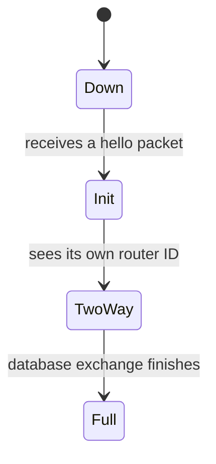

# OSPF 邻居邻接关系

> **英文原名**:OSPF Neighbor Adjacency
> **源文件**:`IGP/OSPF/OSPF Neighbor Adjacency.pdf`(原始 PDF 只读,未做任何改动)
> **规模**:4 页原文 · 引用原文配图 2/2 张 · 自制图 3 个 · 内容覆盖率 100%
> **本章边界**:本章覆盖 hello 报文与邻居发现、邻居状态迁移、DR/BDR 选举、邻居验证命令;不涉及原文之外的其他内容。

## 一、本章概要

本章讲 OSPF 路由器之间是怎么从互不相识变成邻居、再变成完全邻接的。先讲 hello 报文如何发现邻居以及必须匹配哪些参数,再讲邻居状态从 Down 到 Full 的推进过程,然后讲广播网络上 DR 与 BDR 的选举规则,最后用 show ip ospf neighbor 命令验证结果。

## 二、术语速查

| 英文 | 中文 | 原文页 | 备注 |
| --- | --- | --- | --- |
| OSPF | 开放最短路径优先 | p.1 |  |
| Hello Packet | Hello 报文 | p.1 |  |
| Adjacency | 邻接关系 | p.1 |  |
| Designated Router | 指定路由器 | p.3 | 缩写 DR |
| Backup Designated Router | 备份指定路由器 | p.3 | 缩写 BDR |
| Router ID | 路由器 ID | p.2 |  |

## 三、正文精讲

### 1. hello 报文与邻居发现

<sub>原文小节:*Introduction to OSPF Neighbor Adjacency* · 对应页码:p.1</sub>

OSPF 要先找到邻居,才能谈后面的一切。

- **OSPF 路由器靠 hello 报文在链路上发现邻居。** <sub>(p.1)</sub>
  > 原文:OSPF routers use hello packets to discover neighbors on a link.
- **在广播网段上,hello 报文发往组播地址 224.0.0.5,每 10 秒发一次。** <sub>(p.1)</sub>
  > 原文:The hello packet is sent to multicast address 224.0.0.5 every 10 seconds on a broadcast network segment.
- **只有当 hello interval、dead interval、area ID 和子网掩码全部一致时,两台路由器才会成为邻居。** <sub>(p.1)</sub>
  > 原文:Two routers become neighbors only when the hello interval, the dead interval, the area ID and the subnet mask all match.
- **dead interval 默认是 40 秒,正好是 hello interval 的四倍。** <sub>(p.1)</sub>
  > 原文:The dead interval is 40 seconds by default, which is four times the hello interval.

#### 图 · OSPF 邻居发现拓扑


<sub>来自原文第 1 页(`fig-p001-1`)</sub>

图中三台路由器 R1、R2、R3 依次相连,R1 与 R2 之间是 192.168.12.0/24,R2 与 R3 之间是 192.168.23.0/24。每条链路上的两台路由器互发 hello 报文来发现对方。

- 👉 两台路由器要在同一条链路上,hello 报文才能互相收到

<sub>图中可见标签:`R1` · `R2` · `R3` · `192.168.12.0/24` · `192.168.23.0/24` · `OSPF neighbor topology`</sub>

#### 自制图解 · hello 报文如何建立邻居关系

<sub>为什么需要这张图:原文只用一句话说明 hello 报文发现邻居,但没有展示报文在链路上来回的过程,初学者不容易想象 · 依据原文 p.1</sub>

**动画演示(GIF,循环播放):**


**分步静态图(打印 / 离线阅读用):**


<video src="assets/ospf-neighbor-adjacency-69619352/v1.mp4" controls width="720"></video>

只有四项参数全部匹配,双方才会承认对方是邻居。

<details><summary>本图的原文依据</summary>

> OSPF routers use hello packets to discover neighbors on a link.
> Two routers become neighbors only when the hello interval, the dead interval, the area ID and the subnet mask all match.

</details>

### 2. 邻居状态的推进

<sub>原文小节:*Neighbor States* · 对应页码:p.2</sub>

- **在邻接关系建立完成之前,OSPF 邻居会经历若干个状态。** <sub>(p.2)</sub>
  > 原文:An OSPF neighbor moves through several states before the adjacency is complete.
- **最初的状态是 Down,表示还没有收到过任何 hello 报文。** <sub>(p.2)</sub>
  > 原文:The first state is Down, where no hello packet has been received yet.
- **路由器一旦收到 hello 报文,就把该邻居置为 Init 状态。** <sub>(p.2)</sub>
  > 原文:When a router receives a hello packet it moves the neighbor to the Init state.
- **当路由器在收到的 hello 报文里看到自己的 router ID 时,邻居进入 2-Way 状态。** <sub>(p.2)</sub>
  > 原文:Once the router sees its own router ID in the received hello packet, the neighbor moves to the 2-Way state.
- **数据库交换完成之后,邻居到达 Full 状态。** <sub>(p.2)</sub>
  > 原文:After the database exchange finishes, the neighbor reaches the Full state.

#### 自制图解 · 邻居状态迁移图

<sub>为什么需要这张图:原文用四句话描述状态推进,文字形式看不出状态之间的先后与触发条件 · 依据原文 p.2</sub>



每个箭头上的文字就是原文给出的触发条件。

<details><summary>本图的原文依据</summary>

> The first state is Down, where no hello packet has been received yet.
> When a router receives a hello packet it moves the neighbor to the Init state.
> Once the router sees its own router ID in the received hello packet, the neighbor moves to the 2-Way state.
> After the database exchange finishes, the neighbor reaches the Full state.

</details>

### 3. DR 与 BDR 的选举

<sub>原文小节:*Designated Router Election* · 对应页码:p.3</sub>

- **在广播网络上,OSPF 会选出一台 DR 和一台 BDR。** <sub>(p.3)</sub>
  > 原文:On a broadcast network OSPF elects a designated router and a backup designated router.
- **OSPF priority 最高的路由器成为 DR。** <sub>(p.3)</sub>
  > 原文:The router with the highest OSPF priority becomes the designated router.
- **priority 相同时,router ID 最大的路由器赢得选举。** <sub>(p.3)</sub>
  > 原文:When the priority is equal, the router with the highest router ID wins the election.
- **priority 为 0 的路由器永远不会成为 DR。** <sub>(p.3)</sub>
  > 原文:A priority of 0 means the router will never become the designated router.
- **其余路由器只与 DR 和 BDR 建立完全邻接关系。** <sub>(p.3)</sub>
  > 原文:All other routers form a full adjacency only with the DR and the BDR.

#### 图 · DR/BDR 选举拓扑


<sub>来自原文第 3 页(`fig-p003-1`)</sub>

图中 R1、R2、R3 处在同一个广播网络上,选举产生 DR 和 BDR 之后,其余路由器只与这两台建立完全邻接关系。

<sub>图中可见标签:`R1` · `R2` · `R3` · `DR/BDR election topology`</sub>

#### 自制图解 · DR 选举的判定顺序

<sub>为什么需要这张图:原文把选举规则拆在三句话里,容易记混谁先谁后 · 依据原文 p.3</sub>

| 判定顺序 | 条件 | 结果 |
| --- | --- | --- |
| 第 1 步 | 比较 OSPF priority | priority 最高者成为 DR |
| 第 2 步 | priority 相同 | router ID 最大者赢得选举 |
| 特例 | priority 为 0 | 永远不会成为 DR |

<details><summary>本图的原文依据</summary>

> The router with the highest OSPF priority becomes the designated router.
> When the priority is equal, the router with the highest router ID wins the election.
> A priority of 0 means the router will never become the designated router.

</details>

### 4. 验证邻居关系

<sub>原文小节:*Verification* · 对应页码:p.4</sub>

- **用 show ip ospf neighbor 命令来验证邻接关系。** <sub>(p.4)</sub>
  > 原文:Use the show ip ospf neighbor command to verify the adjacency.
- **命令输出会显示邻居状态和对应的接口。** <sub>(p.4)</sub>
  > 原文:The output below shows the neighbor state and the interface.

#### 配置 / 命令(原文 p.4,逐字引用)

```text
R1#show ip ospf neighbor
Neighbor ID     Pri   State           Dead Time   Address         Interface
2.2.2.2           1   FULL/DR         00:00:34    192.168.12.2    GigabitEthernet0/1
```

这段输出对应原文的验证步骤:邻居状态和接口都能在这里看到。

| 原文行 | 说明 |
| --- | --- |
| `2.2.2.2           1   FULL/DR         00:00:34    192.168.12.2    GigabitEthernet0/1` | Neighbor ID 为 2.2.2.2,Pri 为 1,State 为 FULL/DR,接口是 GigabitEthernet0/1。 |

## 四、关键要点回顾

1. hello 报文负责发现邻居,在广播网段上发往 224.0.0.5,每 10 秒一次。
2. hello interval、dead interval、area ID、subnet mask 四项必须全部匹配才能成为邻居。
3. 邻居状态依次是 Down、Init、2-Way、Full。
4. DR 选举先比 OSPF priority,再比 router ID;priority 为 0 的永不当选。
5. show ip ospf neighbor 用来验证邻居状态和接口。

---

## 五、费曼学习法检验 / Feynman Review

> 费曼学习法四步:**讲出来 → 找卡壳 → 回原文 → 再讲一遍**。
> 下面的题目全部来自本章原文,不超纲。先自己答,再看答案。

### 第 1 步:用大白话复述 / Explain it back

两台 OSPF 路由器要合作,得先互相打招呼。它们在链路上不断发 hello 报文,广播网段上这个报文发到 224.0.0.5,每 10 秒一次。收到之后还要核对四样东西:hello interval、dead interval、area ID 和子网掩码,四样全对上才算邻居。接着关系一步步升级:一开始是 Down,收到 hello 变 Init,在对方的 hello 里看见自己的 router ID 就变 2-Way,数据库交换完成就到 Full。如果这是个广播网络,大家还要先选出 DR 和 BDR,其余路由器只跟这两位建立完全邻接。最后用 show ip ospf neighbor 看一眼状态就知道成没成。

**做法:** 合上笔记,照着上面这段话的思路用自己的话讲一遍。讲不下去的地方,就是你的盲点。

### 第 2 步:自测题 / Self-test Questions

**Q1.**〔概念 · 难度 ★〕

- 🇨🇳 OSPF 路由器用什么来发现链路上的邻居?
- 🇬🇧 What do OSPF routers use to discover neighbors on a link?
- 参考图:`fig-p001-1`

**Q2.**〔概念 · 难度 ★〕

- 🇨🇳 在广播网段上,hello 报文发往哪个组播地址?发送间隔是多少?
- 🇬🇧 On a broadcast network segment, to which multicast address is the hello packet sent, and how often?

**Q3.**〔概念 · 难度 ★★〕

- 🇨🇳 两台路由器要成为邻居,必须匹配哪四项参数?
- 🇬🇧 Which four parameters must match before two routers become neighbors?

**Q4.**〔计算 · 难度 ★〕

- 🇨🇳 dead interval 默认是多少秒?它和 hello interval 是什么关系?
- 🇬🇧 What is the default dead interval, and how does it relate to the hello interval?

**Q5.**〔过程 · 难度 ★★〕

- 🇨🇳 邻居状态从最初到完成一共经过哪几个状态?触发条件分别是什么?
- 🇬🇧 Which neighbor states does an OSPF neighbor go through, and what triggers each transition?

**Q6.**〔过程 · 难度 ★★〕

- 🇨🇳 广播网络上 DR 是怎么选出来的?
- 🇬🇧 How is the designated router elected on a broadcast network?
- 参考图:`fig-p003-1`

**Q7.**〔对比 · 难度 ★★★〕

- 🇨🇳 priority 设为 0 的路由器会怎样?其余路由器又和谁建立完全邻接关系?
- 🇬🇧 What happens to a router with a priority of 0, and with which routers do the other routers form a full adjacency?

**Q8.**〔配置 · 难度 ★〕

- 🇨🇳 用哪条命令验证邻接关系?输出里能看到什么?
- 🇬🇧 Which command verifies the adjacency, and what does its output show?

### 第 3 步:常见盲点 / Common blind spots

- 容易只记住 hello interval 要一致,忘了 dead interval、area ID 和子网掩码也必须一致。
- 容易把 2-Way 的触发条件记成收到 hello 报文,实际上是在对方的 hello 报文里看到了自己的 router ID。
- 容易忘记 priority 为 0 的路由器永远不会成为 DR。

### 第 4 步:复习计划 / Review plan

- 第 1 天:合上笔记复述邻居状态的四个阶段与触发条件。
- 第 3 天:只看拓扑图,讲一遍 DR 选举的判定顺序。

### 参考答案 / Answers

<details><summary>点击展开答案(建议先自己作答)</summary>

#### Q1 <sub>(原文 p.1)</sub>

**问 / Q**

- 🇨🇳 OSPF 路由器用什么来发现链路上的邻居?
- 🇬🇧 What do OSPF routers use to discover neighbors on a link?

**答 / A**

- 🇨🇳 用 hello 报文。
- 🇬🇧 They use hello packets to discover neighbors on a link.

**自评要点:**

- [ ] 说出 hello 报文

> 原文依据:OSPF routers use hello packets to discover neighbors on a link.

#### Q2 <sub>(原文 p.1)</sub>

**问 / Q**

- 🇨🇳 在广播网段上,hello 报文发往哪个组播地址?发送间隔是多少?
- 🇬🇧 On a broadcast network segment, to which multicast address is the hello packet sent, and how often?

**答 / A**

- 🇨🇳 发往 224.0.0.5,每 10 秒一次。
- 🇬🇧 It is sent to multicast address 224.0.0.5 every 10 seconds.

**自评要点:**

- [ ] 224.0.0.5
- [ ] 10 秒

> 原文依据:The hello packet is sent to multicast address 224.0.0.5 every 10 seconds on a broadcast network segment.

#### Q3 <sub>(原文 p.1)</sub>

**问 / Q**

- 🇨🇳 两台路由器要成为邻居,必须匹配哪四项参数?
- 🇬🇧 Which four parameters must match before two routers become neighbors?

**答 / A**

- 🇨🇳 hello interval、dead interval、area ID 和子网掩码,四项都要一致。
- 🇬🇧 The hello interval, the dead interval, the area ID and the subnet mask must all match.

**自评要点:**

- [ ] 四项都答出来

> 原文依据:Two routers become neighbors only when the hello interval, the dead interval, the area ID and the subnet mask all match.

#### Q4 <sub>(原文 p.1)</sub>

**问 / Q**

- 🇨🇳 dead interval 默认是多少秒?它和 hello interval 是什么关系?
- 🇬🇧 What is the default dead interval, and how does it relate to the hello interval?

**答 / A**

- 🇨🇳 默认 40 秒,是 hello interval 的四倍。
- 🇬🇧 The dead interval is 40 seconds by default, which is four times the hello interval.

**自评要点:**

- [ ] 40 秒
- [ ] 四倍

> 原文依据:The dead interval is 40 seconds by default, which is four times the hello interval.

#### Q5 <sub>(原文 p.2)</sub>

**问 / Q**

- 🇨🇳 邻居状态从最初到完成一共经过哪几个状态?触发条件分别是什么?
- 🇬🇧 Which neighbor states does an OSPF neighbor go through, and what triggers each transition?

**答 / A**

- 🇨🇳 先是 Down,表示还没收到 hello 报文;收到 hello 报文后进入 Init;在收到的 hello 报文里看到自己的 router ID 后进入 2-Way;数据库交换完成后到达 Full。
- 🇬🇧 The first state is Down, where no hello packet has been received yet. When a router receives a hello packet it moves the neighbor to the Init state. Once the router sees its own router ID in the received hello packet, the neighbor moves to the 2-Way state. After the database exchange finishes, the neighbor reaches the Full state.

**自评要点:**

- [ ] 四个状态顺序正确
- [ ] 说出各自的触发条件

> 原文依据:An OSPF neighbor moves through several states before the adjacency is complete.

#### Q6 <sub>(原文 p.3)</sub>

**问 / Q**

- 🇨🇳 广播网络上 DR 是怎么选出来的?
- 🇬🇧 How is the designated router elected on a broadcast network?

**答 / A**

- 🇨🇳 先比 OSPF priority,最高的成为 DR;priority 相同时比 router ID,最大的赢得选举。
- 🇬🇧 The router with the highest OSPF priority becomes the designated router. When the priority is equal, the router with the highest router ID wins the election.

**自评要点:**

- [ ] 先 priority 后 router ID

> 原文依据:The router with the highest OSPF priority becomes the designated router.

#### Q7 <sub>(原文 p.3)</sub>

**问 / Q**

- 🇨🇳 priority 设为 0 的路由器会怎样?其余路由器又和谁建立完全邻接关系?
- 🇬🇧 What happens to a router with a priority of 0, and with which routers do the other routers form a full adjacency?

**答 / A**

- 🇨🇳 priority 为 0 的路由器永远不会成为 DR;其余路由器只与 DR 和 BDR 建立完全邻接关系。
- 🇬🇧 A priority of 0 means the router will never become the designated router, and all other routers form a full adjacency only with the DR and the BDR.

**自评要点:**

- [ ] 永不当选 DR
- [ ] 只与 DR 和 BDR 完全邻接

> 原文依据:A priority of 0 means the router will never become the designated router.

#### Q8 <sub>(原文 p.4)</sub>

**问 / Q**

- 🇨🇳 用哪条命令验证邻接关系?输出里能看到什么?
- 🇬🇧 Which command verifies the adjacency, and what does its output show?

**答 / A**

- 🇨🇳 用 show ip ospf neighbor;输出会显示邻居状态和接口。
- 🇬🇧 Use the show ip ospf neighbor command; the output shows the neighbor state and the interface.

**自评要点:**

- [ ] 命令名正确
- [ ] 说出状态和接口

> 原文依据:Use the show ip ospf neighbor command to verify the adjacency.

</details>

---

## 附录:可信度说明

- 本笔记由 `nlnotes` 流水线生成,所有知识点均逐条比对过原文英文语句(33/33 条引用通过校验)。
- 原文配图直接从 PDF 中提取,未经改绘;自制图解由本章原文语句驱动生成,依据已折叠在每张图下方。
- 校验报告:`build/reports/ospf-neighbor-adjacency-69619352.json`
- 源 PDF 未被修改:`IGP/OSPF/OSPF Neighbor Adjacency.pdf`
