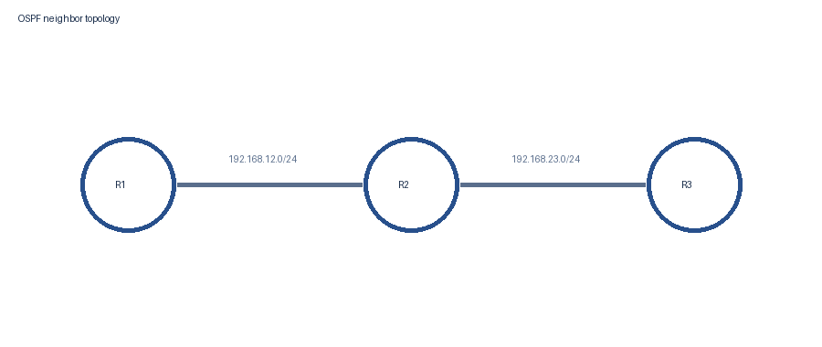
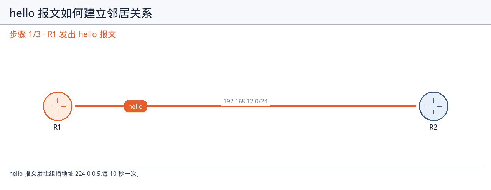
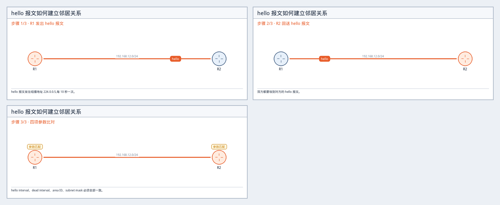
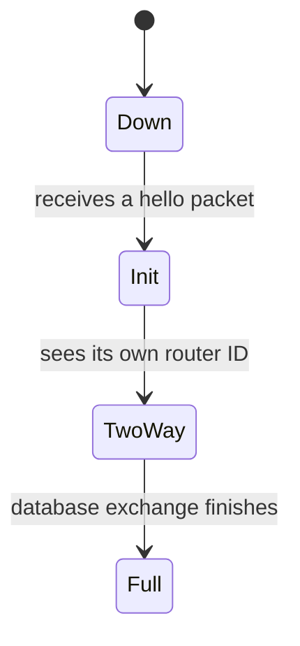
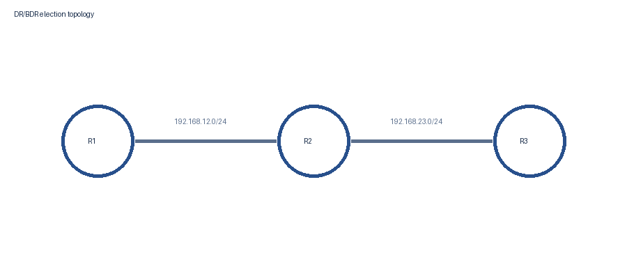

# OSPF 邻居邻接关系

> **英文原名**:OSPF Neighbor Adjacency
> **源文件**:`IGP/OSPF/OSPF Neighbor Adjacency.pdf`(原始 PDF 只读,未做任何改动)
> **规模**:4 页原文 · 引用原文配图 2/2 张 · 自制图 3 个 · 内容覆盖率 100%
> **本章边界**:本章覆盖 hello 报文与邻居发现、邻居状态迁移、DR/BDR 选举规则、邻居验证命令四部分;不涉及原文之外的其他内容。

## 一、本章概要

本章讲 OSPF 路由器之间怎么从互不相识变成邻居、再变成完全邻接。先讲 hello 报文如何在链路上发现邻居,以及必须匹配哪四项参数才算邻居;再讲邻居状态如何从 Down 依次推进到 Init、2-Way,最后到 Full;然后讲广播网络上 DR 与 BDR 的选举规则,以及选出来之后其余路由器只与这两台建立完全邻接;最后用 show ip ospf neighbor 命令验证邻居状态和接口。

## 二、术语速查

| 英文 | 中文 | 原文页 | 备注 |
| --- | --- | --- | --- |
| OSPF | 开放最短路径优先 | p.1 |  |
| Hello Packet | Hello 报文 | p.1 | 本章用来发现邻居 |
| Adjacency | 邻接关系 | p.1 |  |
| Multicast | 组播 | p.1 | hello 发往 224.0.0.5 |
| Subnet Mask | 子网掩码 | p.1 | 必须匹配的四项之一 |
| Router ID | 路由器 ID | p.2 | 2-Way 与选举都用到 |
| Designated Router | 指定路由器 | p.3 | 缩写 DR |
| Backup Designated Router | 备份指定路由器 | p.3 | 缩写 BDR |
| Interface | 接口 | p.4 |  |

## 三、正文精讲

### 1. hello 报文与邻居发现

<sub>原文小节:*Introduction to OSPF Neighbor Adjacency* · 对应页码:p.1</sub>

OSPF 要先在链路上找到邻居,才能谈后面的状态推进和选举。这一节讲清两件事:靠什么发现邻居,以及凭什么判定对方是自己的邻居。

- **OSPF 路由器靠 hello 报文在链路上发现邻居。** <sub>(p.1)</sub>
  > 原文:OSPF routers use hello packets to discover neighbors on a link.

  发现邻居不是靠人工配置对端地址,而是靠在链路上互发 hello 报文。这也解释了后面状态机的起点 Down 为什么被定义成还没有收到过 hello 报文 —— 收不到 hello,就等于这条链路上没有发现任何邻居。 <sub>(另见 p.2)</sub>
- **在广播网段上,hello 报文发往组播地址 224.0.0.5,每 10 秒发一次。** <sub>(p.1)</sub>
  > 原文:The hello packet is sent to multicast address 224.0.0.5 every 10 seconds on a broadcast network segment.

  这里有两个要一起记住的信息:目的地址是组播 224.0.0.5,而不是单播某台路由器;发送周期是 10 秒,也就是 hello interval。后面 dead interval 的 40 秒正是以这个 10 秒为基准的四倍关系。
- **只有当 hello interval、dead interval、area ID 和子网掩码全部一致时,两台路由器才会成为邻居。** <sub>(p.1)</sub>
  > 原文:Two routers become neighbors only when the hello interval, the dead interval, the area ID and the subnet mask all match.

  原文用的是 only when ... all match,也就是四项同时匹配才成立,任意一项不一致都不会成为邻居。这四项里 hello interval 和 dead interval 是时间参数,area ID 和子网掩码是身份与网段参数 —— 排查邻居建不起来时,四项要逐项核对,而不是只看其中一项。
- **dead interval 默认是 40 秒,正好是 hello interval 的四倍。** <sub>(p.1)</sub>
  > 原文:The dead interval is 40 seconds by default, which is four times the hello interval.

  40 秒不是一个孤立的数字,它与 hello interval 的 10 秒是四倍关系。而由于 dead interval 本身也是必须匹配的四项参数之一,两端的取值必须一致。

#### 图 · OSPF 邻居发现拓扑



<sub>来自原文第 1 页(`fig-p001-1`)</sub>

图中三台路由器 R1、R2、R3 依次相连,R1 与 R2 之间是 192.168.12.0/24,R2 与 R3 之间是 192.168.23.0/24。每条链路上的两台路由器互发 hello 报文来发现对方,所以邻居关系是按链路成对建立的,而不是全网一次性建立。

- 👉 两台路由器要在同一条链路上,hello 报文才能互相收到
- 👉 R2 同时在两条链路上,需要分别与 R1 和 R3 建立邻居关系

<sub>图中可见标签:`R1` · `R2` · `R3` · `192.168.12.0/24` · `192.168.23.0/24` · `OSPF neighbor topology`</sub>

#### 自制图解 · hello 报文如何建立邻居关系

<sub>为什么需要这张图:原文只用一句话说明 hello 报文发现邻居,但没有展示报文在链路上来回、以及四项参数比对发生在哪一步,初学者不容易想象 · 依据原文 p.1</sub>

**动画演示(GIF,循环播放):**



**分步静态图(打印 / 离线阅读用):**



<video src="assets/ospf-neighbor-adjacency-69619352/v1.mp4" controls width="720"></video>

只有四项参数全部匹配,双方才会承认对方是邻居。

<details><summary>本图的原文依据</summary>

> OSPF routers use hello packets to discover neighbors on a link.
> Two routers become neighbors only when the hello interval, the dead interval, the area ID and the subnet mask all match.

</details>

### 2. 邻居状态的推进

<sub>原文小节:*Neighbor States* · 对应页码:p.2</sub>

邻接关系不是一步建成的,而是分几个状态逐步推进。这一节的重点是每一步的触发条件,而不是状态的名字。

- **在邻接关系建立完成之前,OSPF 邻居会经历若干个状态。** <sub>(p.2)</sub>
  > 原文:An OSPF neighbor moves through several states before the adjacency is complete.

  原文强调的是在 adjacency 完成之前要经过若干状态,也就是说 Full 之前的每个状态都只是中间态。判断邻接是否真的建好,要看是否到达 Full,而不是看到有邻居条目就认为成功。
- **最初的状态是 Down,表示还没有收到过任何 hello 报文。** <sub>(p.2)</sub>
  > 原文:The first state is Down, where no hello packet has been received yet.
- **路由器一旦收到 hello 报文,就把该邻居置为 Init 状态。** <sub>(p.2)</sub>
  > 原文:When a router receives a hello packet it moves the neighbor to the Init state.

  Init 只说明本端收到了对方的 hello,并不说明对方收到了本端的 hello。所以停在 Init 通常意味着只有单向可达 —— 这也是为什么下一个状态要用在对方的 hello 里看到自己的 router ID 来确认双向。
- **当路由器在收到的 hello 报文里看到自己的 router ID 时,邻居进入 2-Way 状态。** <sub>(p.2)</sub>
  > 原文:Once the router sees its own router ID in the received hello packet, the neighbor moves to the 2-Way state.

  这是本章最容易记错的一处:进入 2-Way 的条件不是又收到一个 hello,而是在收到的 hello 里看到了自己的 router ID。看到自己的 router ID 说明对方也收到过本端的 hello,双向可达因此得到确认,这正是 2-Way 这个名字的含义。
- **数据库交换完成之后,邻居到达 Full 状态。** <sub>(p.2)</sub>
  > 原文:After the database exchange finishes, the neighbor reaches the Full state.

  从 2-Way 到 Full 之间发生的是 database exchange。也就是说 2-Way 只代表互相看见,而 Full 代表数据库也同步完成,两者含义完全不同。

#### 自制图解 · 邻居状态迁移图

<sub>为什么需要这张图:原文用四句话描述状态推进,文字形式看不出状态之间的先后顺序与各自的触发条件 · 依据原文 p.2</sub>



每个箭头上的文字就是原文给出的触发条件。

<details><summary>本图的原文依据</summary>

> The first state is Down, where no hello packet has been received yet.
> When a router receives a hello packet it moves the neighbor to the Init state.
> Once the router sees its own router ID in the received hello packet, the neighbor moves to the 2-Way state.
> After the database exchange finishes, the neighbor reaches the Full state.

</details>

### 3. DR 与 BDR 的选举

<sub>原文小节:*Designated Router Election* · 对应页码:p.3</sub>

在广播网络上,OSPF 不让所有路由器互相建立完全邻接,而是先选出 DR 和 BDR。这一节的重点是选举的判定顺序和一个特例。

- **在广播网络上,OSPF 会选出一台 DR 和一台 BDR。** <sub>(p.3)</sub>
  > 原文:On a broadcast network OSPF elects a designated router and a backup designated router.

  注意原文限定了 On a broadcast network —— 选举这件事和网络类型绑定,不能不加条件地推广到所有情况。同时选出的是两台:designated router 和 backup designated router。
- **OSPF priority 最高的路由器成为 DR。** <sub>(p.3)</sub>
  > 原文:The router with the highest OSPF priority becomes the designated router.

  这里是最高者优先而不是最小者优先,方向很容易记反。判定的第一顺位是 priority,只有在 priority 分不出胜负时才会用到下一个条件。
- **priority 相同时,router ID 最大的路由器赢得选举。** <sub>(p.3)</sub>
  > 原文:When the priority is equal, the router with the highest router ID wins the election.

  router ID 是第二顺位的判定条件,而且同样是最大者胜。所以完整的判定顺序是:先比 priority,priority 相同再比 router ID。把顺序说反,或者漏掉 priority 相同这个前提,都算答错。
- **priority 为 0 的路由器永远不会成为 DR。** <sub>(p.3)</sub>
  > 原文:A priority of 0 means the router will never become the designated router.

  这是选举规则里的一个特例:priority 取 0 时,该路由器被直接排除在 DR 之外,不再参与谁的 priority 更高的比较。
- **其余路由器只与 DR 和 BDR 建立完全邻接关系。** <sub>(p.3)</sub>
  > 原文:All other routers form a full adjacency only with the DR and the BDR.

  原文用了 only,也就是说其余路由器之间不会两两建立完全邻接。这正是选举 DR 和 BDR 的意义所在:把广播网络上的完全邻接关系集中到两台路由器上。

#### 图 · DR/BDR 选举拓扑



<sub>来自原文第 3 页(`fig-p003-1`)</sub>

图中 R1、R2、R3 处在同一个广播网络上,选举产生 DR 和 BDR 之后,其余路由器只与这两台建立完全邻接关系,而不是三台之间两两建立。

- 👉 同一个广播网络上的三台路由器,只会有一台 DR 和一台 BDR

<sub>图中可见标签:`R1` · `R2` · `R3` · `DR/BDR election topology`</sub>

#### 自制图解 · DR 选举的判定顺序

<sub>为什么需要这张图:原文把选举规则拆在三句话里,容易记混谁先谁后,也容易漏掉 priority 为 0 的特例 · 依据原文 p.3</sub>

| 判定顺序 | 条件 | 结果 |
| --- | --- | --- |
| 第 1 步 | 比较 OSPF priority | priority 最高者成为 DR |
| 第 2 步 | priority 相同 | router ID 最大者赢得选举 |
| 特例 | priority 为 0 | 永远不会成为 DR |

按从上到下的顺序判定,前一步分出胜负就不再看下一步。

<details><summary>本图的原文依据</summary>

> The router with the highest OSPF priority becomes the designated router.
> When the priority is equal, the router with the highest router ID wins the election.
> A priority of 0 means the router will never become the designated router.

</details>

### 4. 验证邻居关系

<sub>原文小节:*Verification* · 对应页码:p.4</sub>

前面讲的状态和选举结果,都要能在设备上看出来。这一节给出验证命令和输出的读法。

- **用 show ip ospf neighbor 命令来验证邻接关系。** <sub>(p.4)</sub>
  > 原文:Use the show ip ospf neighbor command to verify the adjacency.
- **命令输出会显示邻居状态和对应的接口。** <sub>(p.4)</sub>
  > 原文:The output below shows the neighbor state and the interface.

  输出里的 State 列正好对应前面讲的状态机:看到 FULL 说明数据库交换已经完成;如果停在 Init 或 2-Way,就要回到那一节去找触发条件没满足的原因。Interface 列则说明这个邻居是在哪条链路上发现的。 <sub>(另见 p.2)</sub>

#### 配置 / 命令(原文 p.4,逐字引用)

```text
R1#show ip ospf neighbor
Neighbor ID     Pri   State           Dead Time   Address         Interface
2.2.2.2           1   FULL/DR         00:00:34    192.168.12.2    GigabitEthernet0/1
```

这段输出对应原文的验证步骤:邻居状态和接口都能在这里看到。State 列的 FULL 说明这个邻居已经到达 Full 状态。

| 原文行 | 说明 |
| --- | --- |
| `Neighbor ID     Pri   State           Dead Time   Address         Interface` | 表头依次是邻居的 Neighbor ID、Pri 也就是 priority、State 状态、Dead Time、Address 和 Interface。 |
| `2.2.2.2           1   FULL/DR         00:00:34    192.168.12.2    GigabitEthernet0/1` | Neighbor ID 为 2.2.2.2,Pri 为 1,State 为 FULL/DR,Dead Time 还剩 00:00:34,接口是 GigabitEthernet0/1。 |

## 四、关键要点回顾

1. hello 报文负责在链路上发现邻居,广播网段上发往组播地址 224.0.0.5,每 10 秒一次。
2. hello interval、dead interval、area ID、subnet mask 四项必须同时匹配才能成为邻居,缺一不可。
3. dead interval 默认 40 秒,是 hello interval 10 秒的四倍。
4. 邻居状态依次是 Down、Init、2-Way、Full;2-Way 的触发条件是在收到的 hello 里看到自己的 router ID。
5. 广播网络上先比 OSPF priority、再比 router ID 选出 DR;priority 为 0 的永不当选。
6. 其余路由器只与 DR 和 BDR 建立完全邻接,而不是两两建立。
7. show ip ospf neighbor 用来验证邻居状态和接口,State 列对应前面的状态机。

---

## 五、费曼学习法检验 / Feynman Review

> 费曼学习法的内核:**讲出来 → 找卡壳 → 回原文 → 再讲一遍**。
> 下面六步就是照这个内核展开的,全部来自本章原文,不超纲、不发散。
> **面试相关内容**(高频原理题、场景题、连环追问、避坑指南)在本协议的
> 面试复习笔记里,不在单章笔记中 —— 那里素材跨章,追问才有深度。

### 第 1 步:用大白话复述 / Explain it back

两台 OSPF 路由器要合作,得先互相打招呼。它们在链路上不断发 hello 报文,广播网段上这个报文发到组播地址 224.0.0.5,每 10 秒一次。光收到还不够,还要核对四样东西:hello interval、dead interval、area ID 和子网掩码,四样全对上才算邻居;其中 dead interval 默认 40 秒,正好是 10 秒的四倍。对上之后关系一步步升级:一开始是 Down,表示还没收到过 hello;收到 hello 就变 Init;在对方发来的 hello 里看见了自己的 router ID,说明对方也收到过本端的,于是变成 2-Way;等数据库交换做完,才到 Full。如果这条链路是广播网络,大家还要先选出 DR 和 BDR:先比 OSPF priority,谁高谁当 DR;priority 一样就比 router ID,谁大谁赢;priority 是 0 的那台永远不当 DR。选完之后,其余路由器只跟 DR 和 BDR 建立完全邻接,不再两两建立。最后在设备上敲 show ip ospf neighbor,看一眼 State 和 Interface,就知道成没成。

**做法:** 合上笔记,照着上面这段话的思路用自己的话讲一遍。讲不下去的地方,就是你的盲点。

### 第 2 步:必须掌握的关键知识点 / Must Master

> 本章最该记住的内容。逐条自问:能不能不看笔记讲清楚?

**1. 成为邻居必须同时匹配四项:hello interval、dead interval、area ID、子网掩码。** <sub>(p.1)</sub>

- **为什么必须掌握**:原文用的是 only when ... all match,四项是同时成立的关系。只记住其中一项,排查邻居建不起来时就会漏掉另外三个原因。
- **记忆抓手**:两个时间参数 hello interval 与 dead interval,加两个身份参数 area ID 与子网掩码。
- <sub>原文依据:Two routers become neighbors only when the hello interval, the dead interval, the area ID and the subnet mask all match.</sub>

**2. 邻居状态的顺序是 Down、Init、2-Way、Full,且每一步都有明确的触发条件。** <sub>(p.2)</sub>

- **为什么必须掌握**:状态是判断邻接建到哪一步的依据;show ip ospf neighbor 的 State 列直接对应这套状态,不记住顺序就读不懂输出。
- **记忆抓手**:没收到 hello 是 Down,收到 hello 是 Init,看到自己的 router ID 是 2-Way,数据库交换完成是 Full。
- <sub>原文依据:An OSPF neighbor moves through several states before the adjacency is complete.</sub>

**3. 进入 2-Way 的条件是在收到的 hello 报文里看到自己的 router ID,而不是又收到一个 hello。** <sub>(p.2)</sub>

- **为什么必须掌握**:这是本章最容易记错的触发条件。看到自己的 router ID 才说明双向可达,这也是 2-Way 这个名字的含义。
- **记忆抓手**:在对方的 hello 里看见自己,才叫双向。
- <sub>原文依据:Once the router sees its own router ID in the received hello packet, the neighbor moves to the 2-Way state.</sub>

**4. DR 选举先比 OSPF priority 且最高者胜,priority 相同再比 router ID 且最大者胜;priority 为 0 的永远不会成为 DR。** <sub>(p.3)</sub>

- **为什么必须掌握**:顺序和方向都极易记反,而且 priority 为 0 这个特例常被忽略。这三句话必须作为一个整体记住。
- **记忆抓手**:先 priority 后 router ID,都是越大越赢;0 是例外,直接出局。
- <sub>原文依据:When the priority is equal, the router with the highest router ID wins the election.</sub>

**5. 选出 DR 和 BDR 之后,其余路由器只与 DR 和 BDR 建立完全邻接,不会两两建立。** <sub>(p.3)</sub>

- **为什么必须掌握**:这是选举 DR 和 BDR 的目的所在。原文用了 only,如果理解成大家仍然互相建立完全邻接,就完全丢掉了选举的意义。
- **记忆抓手**:只跟这两台建立,其余之间不建立。
- <sub>原文依据:All other routers form a full adjacency only with the DR and the BDR.</sub>


### 第 3 步:本章难点 / Difficulties

> 难点不是"内容多",而是"容易理解错"。下面每条都说清了难在哪、怎么突破。

#### 难点 1:2-Way 的触发条件容易记成再收到一个 hello <sub>(p.2)</sub>

- **为什么容易卡住**:Init 和 2-Way 都与收到 hello 报文有关,字面上非常接近,所以很容易把两个状态的触发条件混成同一个。而原文对这两步的表述其实差别很大:一个是收到 hello,另一个是在收到的 hello 里看到自己的 router ID。
- **怎么突破**:抓住方向这个关键区别:Init 只证明单向,即本端收到了对方的;2-Way 证明双向,即对方发来的 hello 里有本端的 router ID,说明对方也收到过本端的。把 2-Way 这个名字和双向绑在一起记,就不会记反。
- <sub>原文依据:Once the router sees its own router ID in the received hello packet, the neighbor moves to the 2-Way state.</sub>

#### 难点 2:四项必须匹配的参数容易只记住一两项 <sub>(p.1)</sub>

- **为什么容易卡住**:四项参数分属两类性质,时间参数与身份参数,数量又刚好超出短期记忆最舒服的范围,所以常见的情况是只记住 hello interval,或者只记住 area ID,导致排查邻居问题时漏查另外几项。
- **怎么突破**:按两类各两项来记:时间类是 hello interval 和 dead interval,身份类是 area ID 和子网掩码。核对时按这两类分别过一遍,而不是凭印象想到哪项查哪项。
- <sub>原文依据:Two routers become neighbors only when the hello interval, the dead interval, the area ID and the subnet mask all match.</sub>

#### 难点 3:DR 选举的判定顺序与方向容易记反 <sub>(p.3)</sub>

- **为什么容易卡住**:选举涉及两个判定条件 priority 与 router ID、一个前提 priority 相同才比 router ID,以及一个特例 priority 为 0,四条信息交织在三句话里。既容易把顺序说反,也容易把最高记成最小,还容易漏掉特例。
- **怎么突破**:先固定顺序:priority 在前,router ID 在后。再固定方向:两个条件都是越大越赢。最后单独挂一个特例:priority 为 0 直接出局。对照本章的 DR 与 BDR 选举拓扑图,把这三条按顺序过一遍。
- **对照图**:`fig-p003-1`
- <sub>原文依据:The router with the highest OSPF priority becomes the designated router.</sub>


### 第 4 步:自测题 / Self-test Questions

**Q1.**〔概念 · 难度 ★〕

- 🇨🇳 OSPF 路由器用什么来发现链路上的邻居?这个报文发往哪个地址、多久发一次?
- 🇬🇧 What do OSPF routers use to discover neighbors on a link, and to which address and how often is it sent?
- 参考图:`fig-p001-1`

**Q2.**〔概念 · 难度 ★★〕

- 🇨🇳 两台路由器要成为邻居,必须匹配哪四项参数?是任意一项匹配即可,还是必须全部匹配?
- 🇬🇧 Which four parameters must match before two routers become neighbors, and must all of them match or just one?

**Q3.**〔计算 · 难度 ★〕

- 🇨🇳 dead interval 默认是多少秒?它和 hello interval 是什么关系?
- 🇬🇧 What is the default dead interval, and how does it relate to the hello interval?

**Q4.**〔过程 · 难度 ★★〕

- 🇨🇳 邻居状态从最初到完成一共经过哪几个状态?每一步的触发条件分别是什么?
- 🇬🇧 Which states does an OSPF neighbor go through from the beginning until the adjacency is complete, and what triggers each transition?

**Q5.**〔概念 · 难度 ★★★〕

- 🇨🇳 Init 和 2-Way 的触发条件有什么本质区别?
- 🇬🇧 What is the essential difference between the triggers for the Init state and the 2-Way state?

**Q6.**〔过程 · 难度 ★★〕

- 🇨🇳 广播网络上 DR 是怎么选出来的?判定顺序是什么?
- 🇬🇧 How is the designated router elected on a broadcast network, and in what order are the criteria applied?
- 参考图:`fig-p003-1`

**Q7.**〔对比 · 难度 ★★★〕

- 🇨🇳 priority 设为 0 的路由器会怎样?选出 DR 和 BDR 之后,其余路由器与谁建立完全邻接关系?
- 🇬🇧 What happens to a router with a priority of 0, and with which routers do the other routers form a full adjacency?

**Q8.**〔配置 · 难度 ★〕

- 🇨🇳 用哪条命令验证邻接关系?输出里能看到哪些信息?
- 🇬🇧 Which command verifies the adjacency, and what information does its output show?

**Q9.**〔排障 · 难度 ★★★〕

- 🇨🇳 如果 show ip ospf neighbor 的 State 列停在 Init,根据本章内容说明还缺了什么条件?
- 🇬🇧 If the State column of show ip ospf neighbor stays at Init, which condition is still missing according to this chapter?

### 第 5 步:常见盲点 / Common blind spots

- 容易只记住 hello interval 要一致,忘了 dead interval、area ID 和子网掩码也必须一致。
- 容易把 2-Way 的触发条件记成收到 hello 报文,实际上是在对方的 hello 报文里看到了自己的 router ID。
- 容易忘记 priority 为 0 的路由器永远不会成为 DR。
- 容易忽略原文里的 only:其余路由器只与 DR 和 BDR 建立完全邻接,而不是两两建立。
- 容易把 40 秒的 dead interval 与 10 秒的 hello interval 之间的四倍关系记成其他倍数。

### 第 6 步:复习计划 / Review plan

- 第 1 天:合上笔记复述邻居状态的四个阶段与各自的触发条件。
- 第 3 天:只看 DR 与 BDR 选举拓扑图,讲一遍选举的判定顺序和 priority 为 0 的特例。
- 第 7 天:对照 show ip ospf neighbor 的输出,说出每一列的含义。

### 参考答案 / Answers

<details><summary>点击展开答案(建议先自己作答)</summary>

#### Q1 <sub>(原文 p.1)</sub>

**问 / Q**

- 🇨🇳 OSPF 路由器用什么来发现链路上的邻居?这个报文发往哪个地址、多久发一次?
- 🇬🇧 What do OSPF routers use to discover neighbors on a link, and to which address and how often is it sent?

**答 / A**

- 🇨🇳 用 hello 报文在链路上发现邻居。在广播网段上,hello 报文发往组播地址 224.0.0.5,每 10 秒发送一次。
- 🇬🇧 They use hello packets to discover neighbors on a link. On a broadcast network segment the hello packet is sent to multicast address 224.0.0.5 every 10 seconds.

**自评要点:**

- [ ] 说出 hello 报文
- [ ] 说出组播地址 224.0.0.5
- [ ] 说出 10 秒

> 原文依据:The hello packet is sent to multicast address 224.0.0.5 every 10 seconds on a broadcast network segment.

#### Q2 <sub>(原文 p.1)</sub>

**问 / Q**

- 🇨🇳 两台路由器要成为邻居,必须匹配哪四项参数?是任意一项匹配即可,还是必须全部匹配?
- 🇬🇧 Which four parameters must match before two routers become neighbors, and must all of them match or just one?

**答 / A**

- 🇨🇳 必须匹配 hello interval、dead interval、area ID 和子网掩码四项,而且是四项全部匹配才能成为邻居,任意一项不一致都不行。
- 🇬🇧 The hello interval, the dead interval, the area ID and the subnet mask must all match; two routers become neighbors only when all four of them match.

**自评要点:**

- [ ] 四项都答出来
- [ ] 说明是全部匹配而不是任意一项

> 原文依据:Two routers become neighbors only when the hello interval, the dead interval, the area ID and the subnet mask all match.

#### Q3 <sub>(原文 p.1)</sub>

**问 / Q**

- 🇨🇳 dead interval 默认是多少秒?它和 hello interval 是什么关系?
- 🇬🇧 What is the default dead interval, and how does it relate to the hello interval?

**答 / A**

- 🇨🇳 dead interval 默认是 40 秒,正好是 hello interval 的四倍;而 hello interval 在广播网段上是 10 秒。
- 🇬🇧 The dead interval is 40 seconds by default, which is four times the hello interval; the hello packet is sent every 10 seconds.

**自评要点:**

- [ ] 40 秒
- [ ] 四倍关系

> 原文依据:The dead interval is 40 seconds by default, which is four times the hello interval.

#### Q4 <sub>(原文 p.2)</sub>

**问 / Q**

- 🇨🇳 邻居状态从最初到完成一共经过哪几个状态?每一步的触发条件分别是什么?
- 🇬🇧 Which states does an OSPF neighbor go through from the beginning until the adjacency is complete, and what triggers each transition?

**答 / A**

- 🇨🇳 先是 Down,表示还没有收到过 hello 报文;收到 hello 报文后进入 Init;在收到的 hello 报文里看到自己的 router ID 后进入 2-Way;数据库交换完成后到达 Full。
- 🇬🇧 The first state is Down, where no hello packet has been received yet. When a router receives a hello packet it moves the neighbor to the Init state. Once the router sees its own router ID in the received hello packet, the neighbor moves to the 2-Way state. After the database exchange finishes, the neighbor reaches the Full state.

**自评要点:**

- [ ] 四个状态顺序正确
- [ ] 说出各自的触发条件
- [ ] 2-Way 的条件说成看到自己的 router ID

> 原文依据:An OSPF neighbor moves through several states before the adjacency is complete.

#### Q5 <sub>(原文 p.2)</sub>

**问 / Q**

- 🇨🇳 Init 和 2-Way 的触发条件有什么本质区别?
- 🇬🇧 What is the essential difference between the triggers for the Init state and the 2-Way state?

**答 / A**

- 🇨🇳 Init 的触发条件是收到 hello 报文,只说明本端收到了对方的报文;2-Way 的触发条件是在收到的 hello 报文里看到自己的 router ID,说明对方也收到过本端的报文,因此确认了双向。
- 🇬🇧 A router moves the neighbor to Init when it receives a hello packet, which only shows one direction. It moves the neighbor to 2-Way once it sees its own router ID in the received hello packet, which shows that the other router has also received its hello.

**自评要点:**

- [ ] Init 只是收到 hello
- [ ] 2-Way 要看到自己的 router ID
- [ ] 点出双向的含义

> 原文依据:Once the router sees its own router ID in the received hello packet, the neighbor moves to the 2-Way state.

#### Q6 <sub>(原文 p.3)</sub>

**问 / Q**

- 🇨🇳 广播网络上 DR 是怎么选出来的?判定顺序是什么?
- 🇬🇧 How is the designated router elected on a broadcast network, and in what order are the criteria applied?

**答 / A**

- 🇨🇳 先比 OSPF priority,priority 最高的路由器成为 DR;如果 priority 相同,再比 router ID,router ID 最大的赢得选举。
- 🇬🇧 The router with the highest OSPF priority becomes the designated router. When the priority is equal, the router with the highest router ID wins the election.

**自评要点:**

- [ ] 先 priority 后 router ID
- [ ] 两者都是最大者胜

> 原文依据:The router with the highest OSPF priority becomes the designated router.

#### Q7 <sub>(原文 p.3)</sub>

**问 / Q**

- 🇨🇳 priority 设为 0 的路由器会怎样?选出 DR 和 BDR 之后,其余路由器与谁建立完全邻接关系?
- 🇬🇧 What happens to a router with a priority of 0, and with which routers do the other routers form a full adjacency?

**答 / A**

- 🇨🇳 priority 为 0 的路由器永远不会成为 DR;选出 DR 和 BDR 之后,其余路由器只与 DR 和 BDR 建立完全邻接关系,不会两两建立。
- 🇬🇧 A priority of 0 means the router will never become the designated router, and all other routers form a full adjacency only with the DR and the BDR.

**自评要点:**

- [ ] 永不当选 DR
- [ ] 只与 DR 和 BDR 完全邻接
- [ ] 点出 only 的含义

> 原文依据:A priority of 0 means the router will never become the designated router.

#### Q8 <sub>(原文 p.4)</sub>

**问 / Q**

- 🇨🇳 用哪条命令验证邻接关系?输出里能看到哪些信息?
- 🇬🇧 Which command verifies the adjacency, and what information does its output show?

**答 / A**

- 🇨🇳 用 show ip ospf neighbor 命令验证邻接关系;输出会显示邻居的状态和对应的接口。
- 🇬🇧 Use the show ip ospf neighbor command to verify the adjacency; the output shows the neighbor state and the interface.

**自评要点:**

- [ ] 命令名正确
- [ ] 说出状态和接口

> 原文依据:Use the show ip ospf neighbor command to verify the adjacency.

#### Q9 <sub>(原文 p.2)</sub>

**问 / Q**

- 🇨🇳 如果 show ip ospf neighbor 的 State 列停在 Init,根据本章内容说明还缺了什么条件?
- 🇬🇧 If the State column of show ip ospf neighbor stays at Init, which condition is still missing according to this chapter?

**答 / A**

- 🇨🇳 停在 Init 说明本端已经收到了对方的 hello 报文,但还没有在收到的 hello 报文里看到自己的 router ID;只有看到自己的 router ID,邻居才会进入 2-Way。
- 🇬🇧 Init means a hello packet has been received, but the router has not yet seen its own router ID in the received hello packet; only then does the neighbor move to the 2-Way state.

**自评要点:**

- [ ] 指出已收到 hello
- [ ] 指出还没看到自己的 router ID

> 原文依据:When a router receives a hello packet it moves the neighbor to the Init state.

</details>

---

## 附录:可信度说明

- 本笔记由 `nlnotes` 流水线生成,所有知识点均逐条比对过原文英文语句(42/42 条引用通过校验)。
- 原文配图直接从 PDF 中提取,未经改绘;自制图解由本章原文语句驱动生成,依据已折叠在每张图下方。
- 校验报告:`build/reports/ospf-neighbor-adjacency-69619352.json`
- 源 PDF 未被修改:`IGP/OSPF/OSPF Neighbor Adjacency.pdf`
